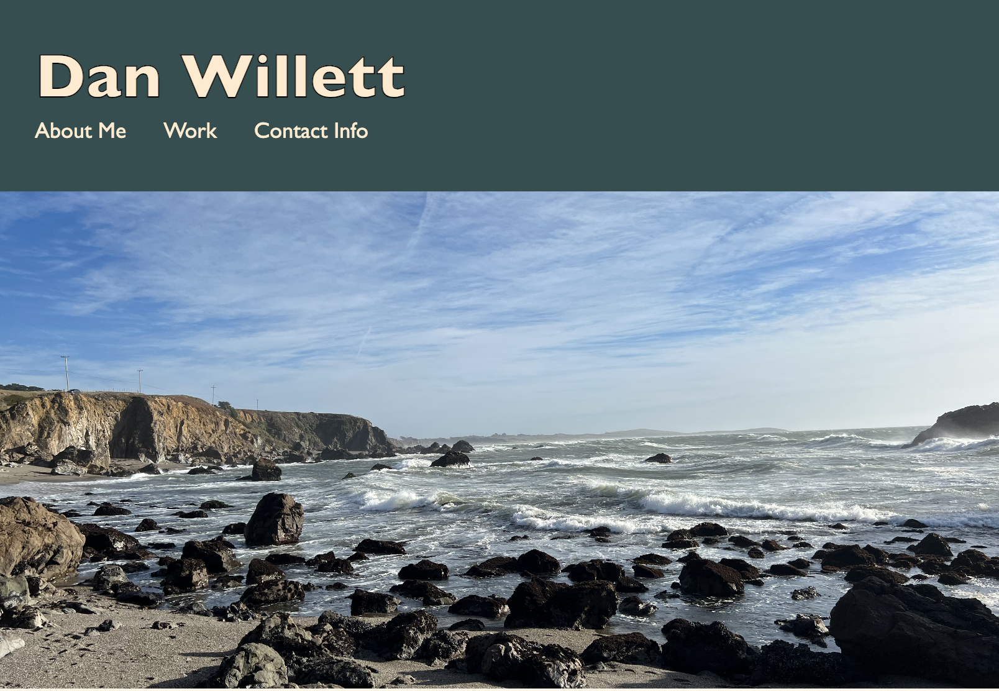

# <professional-portfolio>

## Description

The motivation behind this project was to create a personal portfolio of works I've completed during my coding bootcamp and beyond. The goal would be to showcase my work to potential employers and others looking to learn from my deployed applications. In future variations of this project, I would like to add javascript functionality so adding future works is easier.

## Installation

No steps are required to intall this application. You just need to have a working web browser with access to internet. Navigate to the following link to access the portfolio: _____.

## Usage

To use this portfolio, click the links in the navigation bar to scroll down to the "About Me", "Work", and "Contact" sections. In the "Work" section, clicking on individual projects will direct you to the deployed application's page.

## Credits

NA

## License
MIT license
